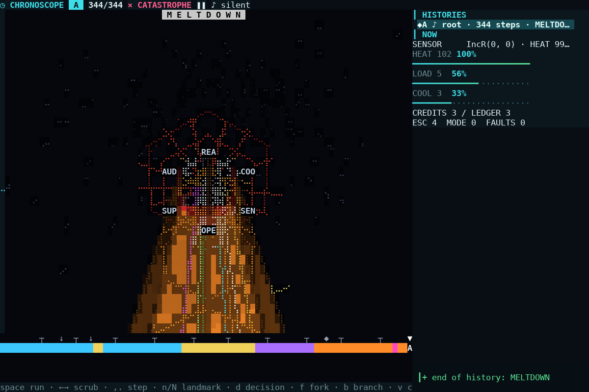
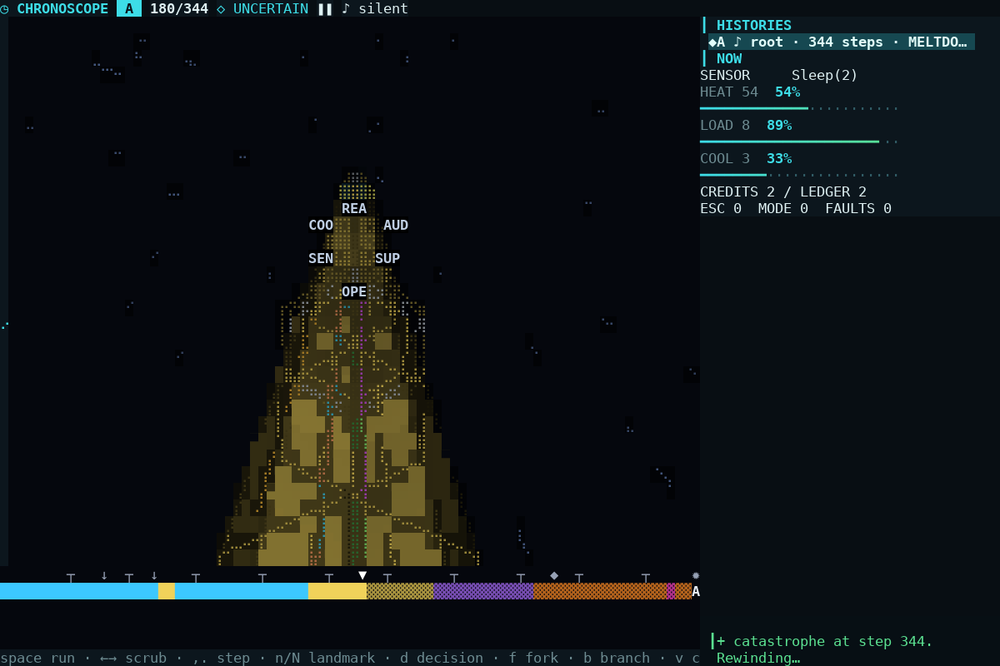
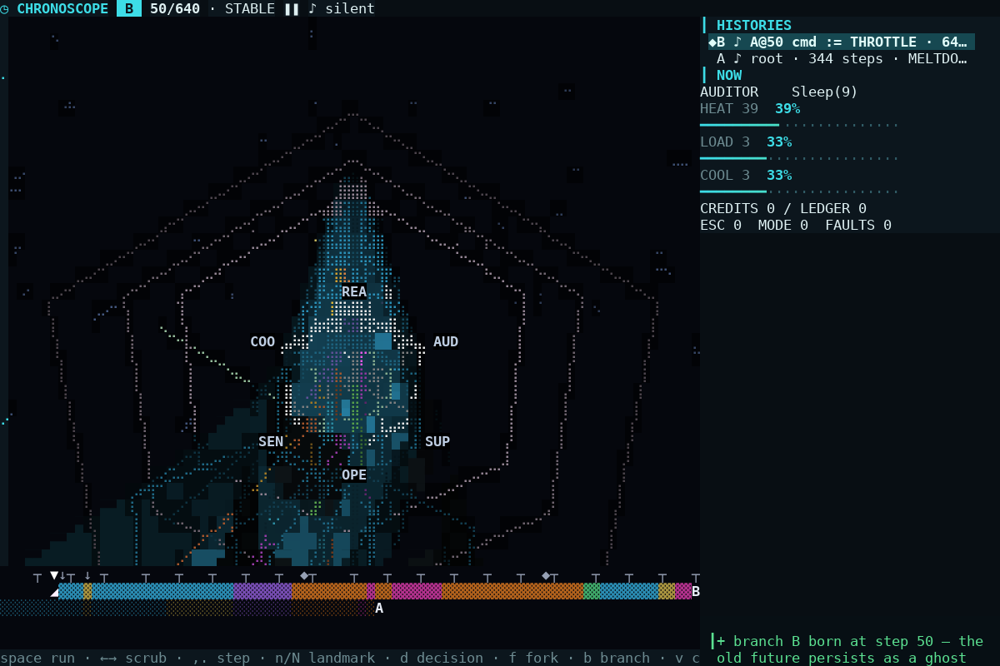
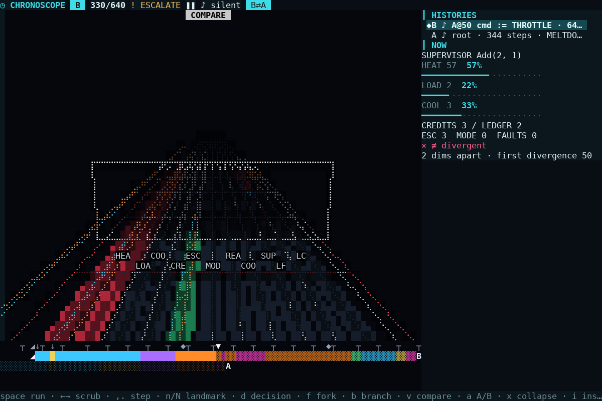
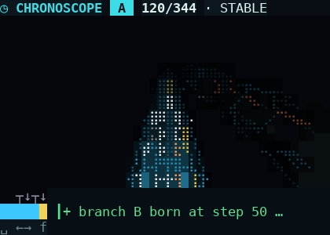
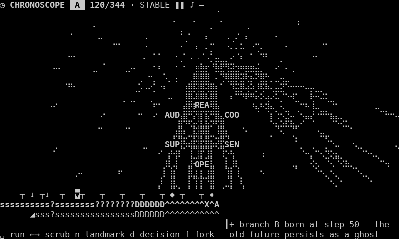
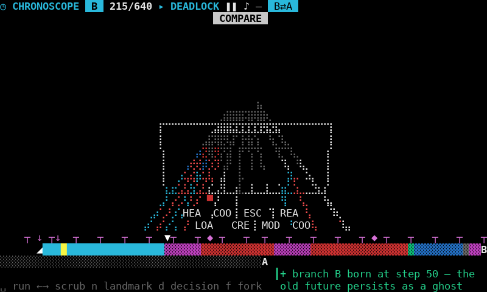

# Project Chronoscope — a debugger for alternate histories

An **external consumer experiment** against the released **LibGibson v0.4.0**
(`libgibson = { git = "https://github.com/femboy2112/libgibson", tag = "v0.4.0" }`, release commit
`c2f6483d92fe2b351e6cd50936a97d8cdf73cb79`; `Cargo.lock` committed; no `[patch]`, no path override, no
branch dependency, no private LibGibson code).

It is a time-travel debugger for a small purpose-built, fully deterministic virtual machine. Execution
history is not a table of instructions; it is a **physical object** you move through: a tunnel whose six
rails are the VM's tasks, whose floor glows with the semantic epoch and with the *actual rendered audio
energy* of each step, whose state variables are threads inside it, whose forks are geometric splits into
parallel planes, and whose dead futures stay behind as ghost geometry.



*Step 344: meltdown. Epoch ribbon (orange = escalation), task rails, the cursor ring, the red scar where
this future ended. 120×40, TrueColor, captured from the real renderer's byte stream and drawn by a VT
emulator + DejaVu (a preview aid, not a claim about any terminal's glyph shapes).*

## Try it

```sh
cargo run --release -- --demo        # the guided sequence below; any key takes over
cargo run --release                  # interactive (needs a TTY); ? shows the keys
cargo run --release -- --mute        # compose music for the visuals but send nothing to a sound device
cargo run --release -- --no-audio    # no HumanMusic at all
```

**The WTF moment** (`--demo`, or by hand): run to the catastrophe → rewind (the camera turns to face the past)
→ change **one input** (BOOST → THROTTLE at step 50) → a second future grows through a different plane while the
first persists as a ghost → compare them → A/B the two musical histories.

| rewind far enough… | …change one input… | …and compare |
|---|---|---|
|  |  |  |

Compare mode re-lays the world as a **braid of dimensions**: identical dimensions fuse into one thread
(`≡`), semantically equivalent ones run side by side with weld ticks (`≈`), divergent ones pull apart (red
floor lanes), and the causal root of the difference (the intervention) is a glowing cross-section plane. A
`≈` is *never* shown as byte-identical: the VM keeps two digests (computation, provenance), and the UI says
`≡ byte-identical` only when the full digest matches.

### The same scene, degraded

| 42×15 TrueColor | 80×24 Mono (letters + stipple carry the meaning) | 80×24 ANSI16 compare |
|---|---|---|
|  |  |  |

The full matrix (5 sizes × 4 colour depths × 6 scenes, plus the four glyph-realization families) is measured in
[`docs/evidence/matrix.md`](docs/evidence/matrix.md) and asserted in `tests/render.rs`.

### Keys

| | |
|---|---|
| `space`/`p` run·pause, `+`/`-` speed (1× is audio-synced 5.9 steps/s) | `←→` `,.` step · `H L` ±8 · `[ ]` ±32 · `Home End` · `c` jump to the end |
| `n/N` landmark · `d/D` decision · `e/E` epoch · `g/G` input | `f` fork here (choose the one change) · `b/B` switch history |
| `v` compare · `V` next target · `a` A/B audio · `x` collapse/rejoin lanes | `i` inspect (causal parents) · `t` turn · `o` inside/outside camera · `m` mute · `q` quit |

`Tab` walks the focus ring (viewport → history rows); `Esc` returns focus to the viewport. The viewport is a
keyed `on_event` control, so while it has focus the arrows scrub time (see FRICTION.md: otherwise the UI
layer would spend them on focus traversal).

## Headless, deterministic, capturable

```sh
# any execution step / branch, any size, any colour depth, any glyph family
cargo run --release -- --capture --size=80x24 --color=mono --glyphs=ascii \
    --script="end; goto 50; fork replace2; branch 0; goto 120"
cargo run --release -- --capture --size=120x40 --script="goto 214; inspect" --ansi=/tmp/frame.ansi
python3 tools/ansi_to_png.py /tmp/frame.ansi 120x40 /tmp/frame.png    # preview only

cargo run --release -- --sustained --frames=12000     # the long deterministic workload
cargo run --release -- --evidence=audio               # HumanMusic measurements (docs/evidence/audio.md)
cargo run --release -- --evidence=matrix              # 5 sizes × 4 colour depths × 6 scenes
cargo run --release -- --wav-out=/tmp/wavs --script="end; goto 50; fork replace2"   # every branch's audio
cargo test --release                                  # 104 tests + 1 opt-in (release: HumanMusic is ~50× slower in debug)
```

Fixed program + fixed seed + fixed action sequence + fixed virtual time ⇒ identical bytes on the wire
(`tests/render.rs::identical_program_seed_and_actions_give_identical_bytes`).

## Architecture in one page

| layer | what | where |
|---|---|---|
| **VM** | six cooperating tasks (REACTOR, COOLER, SENSOR, OPERATOR, SUPERVISOR, AUDITOR), two mutexes taken in opposite orders (real deadlock), bounded channels (back-pressure), seeded **decisions** (forkable "fate points"), crashes, supervised recovery, a thermal invariant whose violation is terminal. Bounded by `MAX_STEPS`; no host I/O; no code from outside. | `src/vm.rs`, `src/fixture.rs` |
| **Replay model** | a branch is fully determined by `(program, seed, script)` where the script is the ordered inputs (operator commands, decision overrides). Everything else — per-step records, checkpoints, digests — is a **cache of that replay**. | `src/history.rs` |
| **Branch model** | a fork at position *p* shares positions `0..=p` with its parent and owns only what follows; the old future stays. Retention is bounded: old branches are *fossilized* (~1 KiB: first checkpoint + summary) and rebuilt bit-for-bit by replay when revisited. | `src/history.rs` |
| **Semantics** | per-step *epoch* (stable · uncertainty · escalation · deadlock · contradiction · resolution · convergence · catastrophe) and a declared **semantic projection** used for `≈` comparisons. | `src/epoch.rs`, `src/sem.rs` |
| **Audio** | one deterministic HumanMusic *performance per branch future*; the **past is immutable scrollback** (a child keeps the parent's PCM bit-for-bit up to the fork), the future is a new composition crossfaded in over 0.35 s *after* the fork. No fake seeking. | `src/audio.rs` |
| **Atmosphere** | LibGibson `Story` + `Scene` driven by *history time*: the director at any `(branch, position)` is rebuilt from a cloned checkpoint + replay of recorded updates. | `src/director.rs` |
| **View** | depth-tested Braille wireframe (own projection from the public `Camera`) + half-block filled channel via the public `Rasterizer`; chase/inside cameras that face where time is going. | `src/view3d.rs` |
| **UI** | `gibson::ui` chrome, keyed focus, modals, toasts; the headless rig shares `Model`, `build_screen`, `UiRuntime::frame` and `route_event` with the real loop (the terminal I/O, signal handling and audio player are PTY-tested separately). | `src/ui.rs`, `src/app.rs`, `src/driver.rs` |

### Two clocks, never mixed

*History time* (the cursor) determines everything semantic and can be rebuilt exactly. *Presentation time*
(camera glide, fork bloom, toasts) only drives motion and is monotone — `UiRuntime` clamps time backwards, so
history time must never be fed to it.

## What this experiment found (short)

Easy going **forward**, painful going **backward** — details and evidence in
[`EXPERIMENT_REPORT.md`](EXPERIMENT_REPORT.md) and [`FRICTION.md`](FRICTION.md):

* `HumanMusicSynth` cannot seek and `compose` is not prefix-causal (measured: the raw whole-trace performances of a
  parent and its fork differ from the very first frame, `docs/evidence/audio.md`) → audio had to become
  *whole performances per branch, immutable past, crossfaded future*.
* `StoryDirector` has no restore or seek and `Scene` has no entity removal → history-time rebuild by checkpoint +
  replay (cheap: ~11–18 µs per snapshot) and a settling-shake workaround, because `Effect::Shake` never settles.
* Keyed focus survives rebuilding historical trees and modal capture/restore works; it does *not* survive a
  keyed control disappearing and reappearing (responsive layout; asserted in `tests/ui.rs`, restorable with
  `UiRuntime::set_focus`).
* The composed frame is readable by an outsider only as *text*; colours/attributes need a VT emulator.

## Not claimed

Windows/macOS/tmux/SSH/other terminals; real audio-device playback (the player path spawns `pw-play`/`paplay`/
`aplay` on a WAV; `tests/pty_audio.rs` asserts the lifecycle with a *fake* `pw-play` on `PATH`: argv, WAV integrity,
stop/replace, an instantly-exiting player, orphan cleanup — no sound reached a device); any perceptual or musical quality
claim (nobody *listened* in this run); any claim about LibGibson beyond the pinned v0.4.0 tag.

## Layout

```
src/        vm fixture history epoch sem audio director view3d ui app driver demo bench evidence main
tests/      core vm audio story render ui capability pty pty_audio pty_resize_collision(ignored) sustained demo
examples/   tune.rs (the fixture-tuning search; see EXPERIMENT_REPORT §1.1)
docs/       evidence/ (measured), img/ (previews), upstream/ (minimal repros filed against LibGibson)
tools/      ansi_to_png.py (preview aid)
```
